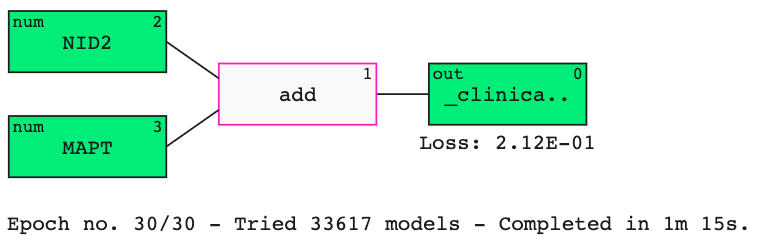
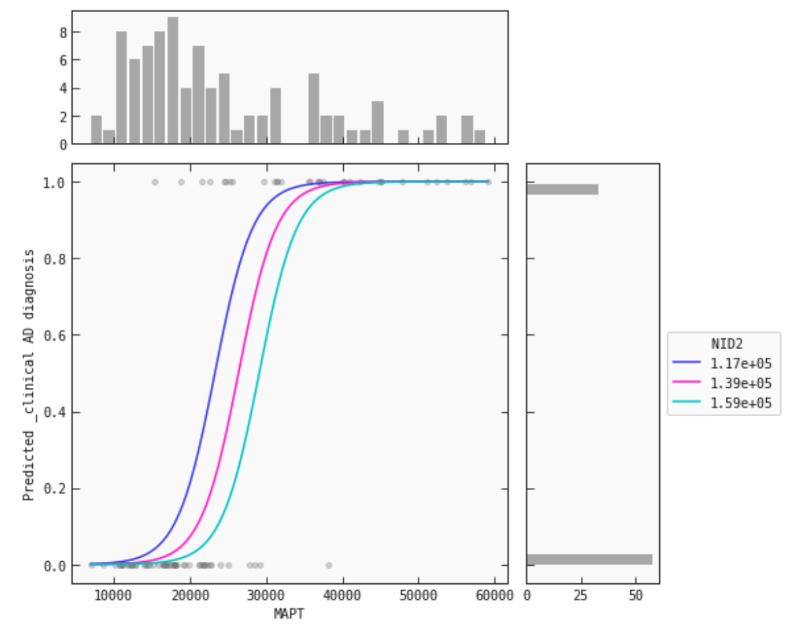

# QLattice Clinical Omics paper

Analysis and data for "Identifying molecular interactions in omics data for clinical biomarker discovery"
paper.

Accompanying manuscript:

Identifying interactions in omics data for clinical biomarker discovery using symbolic 
regression.<br/>Bioinformatics (2022) https://academic.oup.com/bioinformatics/article/38/15/3749/6613136.


### Disclaimer

The results of the paper (contained in the notebooks) were generated using feyn 2.1.2, in combination with a remote call to Abzu's 
servers. Feyn 2 and the remote server are now deprecated, and substituted by feyn 3 -- which runs fully locally. Feyn is
the library containing the QLattice algorithm https://docs.abzu.ai/.

### Trasition to feyn 3

To be able to use the QLattice algorithm it is necessary to upgrade your code to feyn 3. Instructions on how to do it can be found
in https://docs.abzu.ai/docs/guides/getting_started/transition.html.


### QLattice tutorial

We include in this README a tutorial on how to train QLattice models using feyn 3. 
Its Jupyter notebook can be found in the `notebooks` folder of this repository.

Other tutorials can be found in the [Feyn+QLattice documentation page](https://docs.abzu.ai/docs/tutorials/python/covid_mrna.html).

---
QLattice Tutorial: Finding AD biomarkers in proteomics data
---
<div style='visibility:hidden' id='notebook-meta' data-filetype='.csv' data-notebook='.ipynb'></div>

Feyn version: 3.0.1+

Can the QLattice deal with omics data that is noisy and contains thousands of features? It certainly can!

Omics data typically contains hundreds to thousands of features (proteins, transcripts, methylated DNA etc.) that are measured in samples derived from sources such as blood, tissue or cell culture. These types of approaches are often used for exploratory analysis e.g. in **biomarker discovery** or understanding the **mechanism of action** of a certain drug. It often resembles a bit of a "fishing exercise".

Thus, there is a need to quickly and reliably identify the most important **features** and their **interactions** that contribute to a certain signal (e.g. disease state, cell-type identity, cancer detection).

In this tutorial we present a brief workflow for building simple and interpretable models for proteomics data. This specific example is taken from a study by [Bader & Geyer et al. 2020](https://www.embopress.org/doi/full/10.15252/msb.20199356) (Mann group) and contains samples taken from the cerebrospinal fluid of Alzheimer Disease (AD) patients and non-AD patients. We will show you how to build `QLattice` model that can classify people into AD and non-AD according to their proteomic profiles.

The dataset contains over a thousand features (features in this example describe the intensity of different proteins measured by mass spectrometry).


```python
import numpy as np
import pandas as pd
import feyn

from sklearn.model_selection import train_test_split
import matplotlib.pyplot as plt
```

## Load the data
Note, the data has been preprocessed and missing values have been imputed.
It contains **1166 proteins** and **88 non-AD** and **49 AD** subjects.


```python
data = pd.read_csv("../data/ad_omics.csv")

# Let's record the categorical data types in our dataset (note features will be treated as numerical by default).
stypes = {}
for f in data.columns:
    if data[f].dtype =='object':
        stypes[f] = 'c'
```

## Split dataset into train and test set


```python
# Set random seed for reproducibility
random_seed = 42

# Define the target variable
target = "_clinical AD diagnosis"

# Split
train, test = train_test_split(data, test_size=0.33, stratify=data[target], random_state=random_seed)
```

## Train the QLattice

### Sample and fit models

This occurs in the following steps:

1. Sample models from the QLattice;
2. Fit the models by minimizing [BIC (Bayesian Information Criterion)](https://en.wikipedia.org/wiki/Bayesian_information_criterion);
3. Update the QLattice with the best models' structures;
4. Repeat the process;

This is all captured within the `auto_run` function


```python
# Connecting
ql = feyn.connect_qlattice()

# Reset and set random seed
ql.reset(random_seed=random_seed)

# Sample and fit models
models = ql.auto_run(
    data=train,
    output_name=target,
    kind='classification',
    stypes=stypes,
    n_epochs=30
    )
```




## Inspect the top model


```python
best = models[0]
best.plot(train, test)
```


With the plot below, we inspect the *Pearson correlation* between the values at each node and the true output:


```python
best.plot_signal(train)
```


As expected, `MAPT` (i.e. Tau) seems to be driving most of the signal here. Let's investigate further.

## Explore features

Let's look at how the different features play together.


```python
show_quantiles = 'NID2'
fixed = {}
fixed[show_quantiles] = [
    train[show_quantiles].quantile(q=0.25),
    train[show_quantiles].quantile(q=0.5),
    train[show_quantiles].quantile(q=0.75)
]

best.plot_response_1d(train, by = "MAPT", input_constraints=fixed)
```





This response plot shows you how higher `NID2` levels shift the `MAPT` curve to the left. I.e. the higher your `NID2` levels, the lower your `MAPT` levels have to be for a positive AD prediction.
